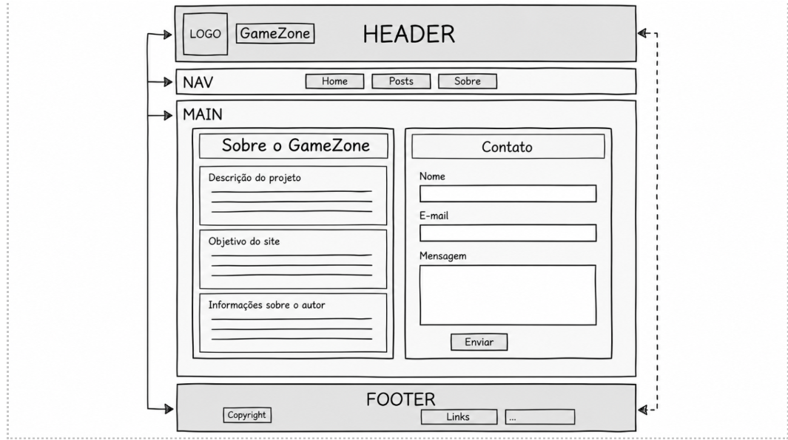

# GameZone

## Descrição do projeto

O GameZone é um blog educacional sobre jogos, desenvolvido individualmente por Henrique Pereira para a Situação de Aprendizagem 01 do curso Técnico em Desenvolvimento de Sistemas.

O site apresenta conteúdos sobre tecnologia, esports, jogos independentes, acessibilidade e cuidados com equipamentos. A interface foi criada com HTML5, CSS3 e JavaScript, seguindo os wireframes e a identidade visual planejada para o projeto.

## Como acessar

1. Baixe ou clone este repositório.
2. Abra o arquivo `Gamezone/index.html` em um navegador moderno.
3. Use o menu principal para navegar entre Início, Posts e Sobre.

O projeto é estático e não exige instalação de pacotes, servidor ou banco de dados.

## Páginas e funcionalidades

- **Início:** banner de apresentação e três posts em destaque.
- **Posts:** seis conteúdos expansíveis e uma tabela comparativa de gêneros.
- **Sobre e contato:** apresentação do projeto, objetivos, informações do autor e formulário demonstrativo.
- **Menu responsivo:** navegação adaptada para computadores, tablets e celulares.
- **Acessibilidade:** HTML semântico, textos alternativos, rótulos de formulário, foco visível, navegação por teclado e link para pular ao conteúdo.

> O formulário valida os campos e exibe uma confirmação local. Nenhum dado é enviado ou armazenado.

## Requisitos atendidos

| Requisito | Implementação |
|---|---|
| Desenvolvimento individual | Projeto identificado com um único autor |
| Três páginas interligadas | `index.html`, `posts.html` e `sobre.html` |
| Estrutura organizada | Pastas separadas para páginas, estilos, scripts, imagens, ícones e documentos |
| HTML5 semântico | Uso de `header`, `nav`, `main`, `section`, `article`, `footer` e outros elementos adequados |
| CSS externo | Todas as páginas utilizam `Gamezone/css/style.css` |
| Navegação funcional | Menus principal e de rodapé disponíveis nas três páginas |
| Imagens, listas e links | Aplicados de acordo com o conteúdo do blog |
| Tabela | Comparação de gêneros na página de posts |
| Formulário | Contato demonstrativo com validação HTML e retorno em JavaScript |
| Código organizado | Arquivos indentados e nomes consistentes |
| Controle de versão | Histórico mantido com Git e repositório hospedado no GitHub |

## Decisões técnicas

- A estrutura das páginas segue os wireframes criados antes da implementação.
- A paleta utiliza grafite profundo (`#101318`), azul-ardósia (`#202A36`) e dourado (`#E0B95A`).
- Os títulos usam Archivo e os demais textos usam Source Sans 3, com alternativas do sistema.
- O layout usa Grid e Flexbox para adaptar cards e seções a diferentes larguras de tela.
- O JavaScript foi limitado ao menu móvel e à confirmação do formulário, mantendo o projeto compatível com o conteúdo estudado.
- Os posts têm conteúdo autoral e atemporal, sem depender de notícias externas.

## Wireframes

### Página inicial


### Página de posts


### Página sobre e contato



## Estrutura de arquivos

```text
novaweb-projeto-inicial/
├── Gamezone/
│   ├── assets/
│   │   ├── icons/
│   │   └── images/
│   ├── css/
│   │   └── style.css
│   ├── docs/
│   │   └── wireframes do projeto
│   ├── js/
│   │   └── script.js
│   ├── pages/
│   │   ├── posts.html
│   │   └── sobre.html
│   ├── CREDITOS_ASSETS.md
│   └── index.html
├── aula 02/
├── aula 03/
├── aula 10 e 13/
├── exercicio 5/
├── NOTAS_ESTUDO.md
└── README.md
```

## Tecnologias e ferramentas

- HTML5
- CSS3
- JavaScript
- Visual Studio Code
- Git e GitHub
- Miro

## Status

Projeto implementado e pronto para revisão final. As três páginas estão interligadas, estilizadas e adaptadas para diferentes tamanhos de tela.

## Autor

Henrique Pereira — turma TDE-1BAA-26.
